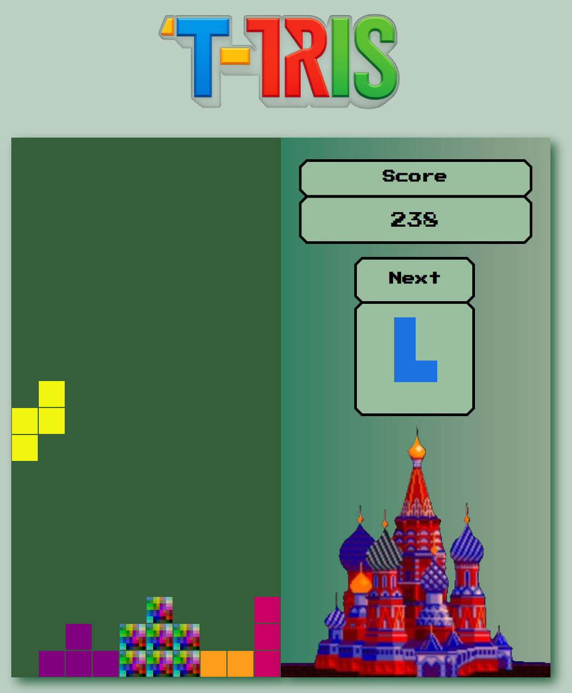

# T-Tetris

A classic Tetris clone with a magical twist: **the T-piece dissolves** and fills all the cells beneath it, creating a unique gameplay experience!

 

[Play it live here!](https://tonyrod116.github.io/T-Tetris/) 

## Table of Contents

1. [Description](#description)
2. [Installation](#installation)
3. [Technologies Used](#technologies-used)
4. [Features](#features)
5. [Planning](#planning)
6. [Code Process](#code-process)
7. [Challenges](#challenges)
8. [Wins & Key Learnings](#wins--key-learnings)
9. [Known Bugs](#known-bugs)
10. [Future Improvements](#future-improvements)
11. [Credits](#credits)

---

## Description

T-Tetris is a single-player browser game inspired by the original Tetris, but with a unique twist:
> When the **T-piece** lands, it dissolves! Each cell of the T falls straight down independently, filling all empty cells below—**without erasing its original path**. This special mechanic adds extra challenge and strategy, since you can fill the board more quickly (or clear lines creatively) with the T-piece.

- **Score more**: Get higher points for placing pieces higher up on the board.
- **Modern UX**: Responsive design, pixel-art style, and classic Tetris soundtrack.

---

## Installation

1. **Clone this repository**  
   `git clone https://github.com/tonyrod116/T-Tetris.git`

2. **Open the game**  
   Open `index.html` in your favorite browser.

*No external dependencies. Pure HTML, CSS, and JavaScript.*

---

## Technologies Used

- HTML5
- CSS3
- JavaScript (Vanilla)
- [HTML5 Audio](https://developer.mozilla.org/en-US/docs/Web/HTML/Element/audio)
- [Press Start 2P Font](https://fonts.google.com/specimen/Press+Start+2P)

---

## Features

- Classic Tetris gameplay: all 7 tetrominoes
- Next piece preview
- Scoreboard and high score
- **Special mechanic:** T-piece dissolves and each cell falls down, filling all cells in its vertical path
- The original T cells remain occupied—**the T leaves a trail!**
- Soundtrack and SFX
- Responsive and retro UI

---

## Planning

- Whiteboard sketches of layout and logic
- Main game grid: 10x20
- Next-piece board: 10x4 (same number of columns for easier rendering)
- Iterative feature development (scoreboard, music, dissolving T, etc.)

<!-- If you have sketches or Trello/Notion, link them here -->

---

## Code Process

1. **Grid rendering** with CSS grid and JS
2. **Piece movement** and collision logic
3. **Special mechanic for T**:
   - When the T-piece lands, remove its original classes.
   - For each cell of the T, drop it as far down as possible, filling every cell it passes with an “occupied” block (the trail is permanent).
   - This can create creative obstacles or help clear lines fast!
4. **Row clearing** and “blink” animation
5. **Score logic** based on height

---

## Challenges

- Getting the T-piece to dissolve and leave a permanent trail required extra collision and cleanup logic.
- Making sure no “ghost” T-cells remained after animation.
- Handling edge cases where dissolving T overlaps other pieces or at the board edge.
- Syncing blink animation with T-dissolving logic.

---

## Wins & Key Learnings

- Learned advanced DOM manipulation and game loop control.
- Improved understanding of JS event handling, timers, and CSS grid.
- Developed custom logic for a unique Tetris mechanic!

---

## Known Bugs

- (Intentional) The T-piece will fill every cell it passes when dissolving, even if that creates a block “trail”.
- Occasionally, if the T lands during a row-clear blink, a visual “ghost” may appear—refresh fixes this.
- Sound may not autoplay on some browsers due to autoplay policies.

---

## Future Improvements

- Responsiveness for smaller screens
- Add touch/mobile controls.
- New sound effects and custom soundtrack.
- Toggle option for classic T or dissolving T mechanic.
- More power-ups and creative piece effects.
- Polish visuals and add animations for all piece drops.

---

## Credits

- Game developed by [Tony Rod](https://github.com/tonyrod116)
- “Press Start 2P” font by [codeman38](https://fonts.google.com/specimen/Press+Start+2P)
- Tetris theme: public domain
- Inspired by the original Tetris

---

*Feel free to fork or submit PRs!*

